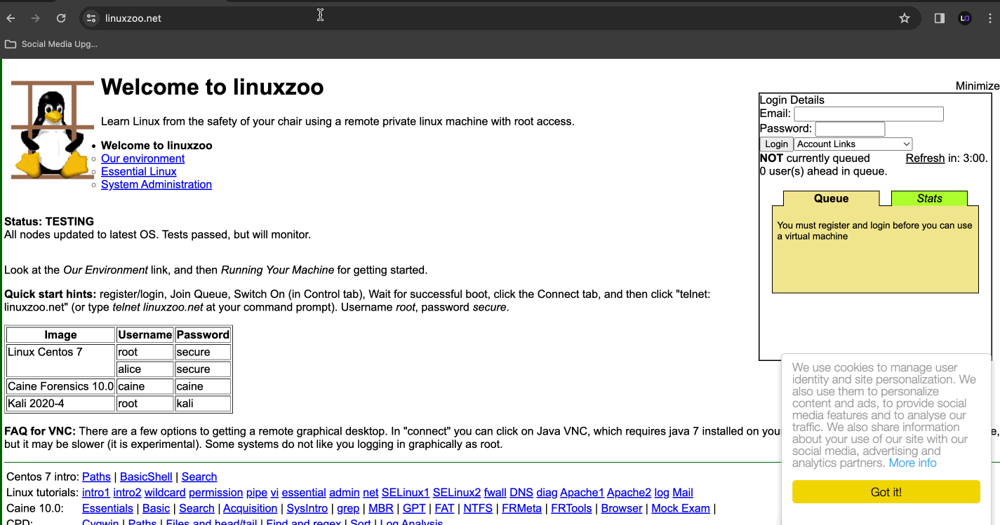
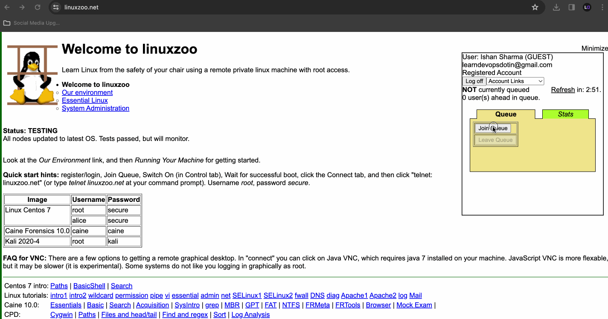

- [Introduction](#introduction)
- [Using a Virtual Machine](#using-a-virtual-machine)
- [Using Public Cloud](#using-public-cloud)
  - [Helpful Videos (English Only)](#helpful-videos-english-only)
- [Using Remote Linux Machine via `Linuxzoo.net`](#using-remote-linux-machine-via-linuxzoonet)
- [Additional Resources](#additional-resources)
- [Conclusion](#conclusion)

## Introduction

In today's tech landscape, hands-on practice is crucial for mastering Linux and related skills. Creating a Linux virtual machine provides an excellent environment for experimentation, learning, and skill development. This guide outlines different methods to set up a Linux virtual machine for hands-on practice.

## Using a Virtual Machine

Using virtualization software like VirtualBox, you can create a Linux virtual machine on your local computer. Follow these steps:

1. Download and install VirtualBox on your host machine.
2. Download a Linux distribution ISO file (e.g., Ubuntu, CentOS) from the official website.
3. Open VirtualBox and create a new virtual machine.
4. Configure the virtual machine settings, including RAM, CPU, storage, and network.
5. Start the virtual machine and install the Linux distribution using the ISO file.
6. Once installed, you can start using the Linux virtual machine for hands-on practice.

## Using Public Cloud

Public cloud providers like Amazon Web Services (AWS), Microsoft Azure, and Google Cloud Platform (GCP) offer virtual machine instances that you can use for hands-on practice. This option is **recommended** if you have already public cloud access or can get one as it allows to explore cloud platform and linux at the same time.

Here's how to set up a Linux virtual machine on a public cloud:

1. Sign up for an account with the public cloud provider (if you don't have one already).
2. Navigate to the respective console or dashboard.
3. Choose the desired virtual machine instance type (e.g., EC2 on AWS, VM on Azure).
4. Select a Linux distribution image (e.g., Ubuntu, CentOS).
5. Configure the instance settings, including region, instance type, storage, and networking.
6. Launch the virtual machine instance.
7. Once the instance is running, connect to it using SSH or a remote desktop protocol.
8. You can now use the Linux virtual machine on the public cloud for hands-on practice.

### Helpful Videos (English Only)

- [How to Create an EC2 Instance in AWS](https://www.youtube.com/watch?v=0Gz-PUnEUF0)
- [How to create Linux Virtual Machine on Microsoft Azure](https://www.youtube.com/watch?v=kWzmIMPDPvI)
- [How to create and connect to Ubuntu Machine On GCP](https://www.youtube.com/watch?v=p3qO2gQa31c)

## Using Remote Linux Machine via `Linuxzoo.net`

[Linuxzoo.net](https://linuxzoo.net/) provides free access to remote Linux machines for hands-on practice. I recommend this option in general if above two options are not available for you, as it required no configuration on your end and also can work with any machine with minimal compute resources and totally free of charge. However, in some cases it may lack few features and only limited to few linux flavours.

Here's how to get started:

1. Visit [Linuxzoo.net](https://linuxzoo.net/) in your web browser.
2. Sign up for an account or log in if you have one.

- **Refer to below tutorial for sign up process**

3. Join the `Queue`
4. Choose a Linux machine from the available options.
5. Switch On the machine
6. Wait for the boot process and click on connect
7. Access the remote Linux machine using the provided credentials (`SSH` or `telnet`). The credentials are listed on the [main page](https://linuxzoo.net/) as well.
8. Start using the remote Linux machine for hands-on practice.
- **Refer to below tutorial for connection process**

## Additional Resources

- [VirtualBox Documentation](https://www.virtualbox.org/wiki/Documentation)
- [AWS EC2 Documentation](https://docs.aws.amazon.com/ec2/index.html)
- [Azure Virtual Machines Documentation](https://docs.microsoft.com/en-us/azure/virtual-machines/)
- [Google Cloud Compute Engine Documentation](https://cloud.google.com/compute/docs)

## Conclusion

Creating a Linux virtual machine for hands-on practice is essential for building and refining Linux administration skills. Whether you choose to set up a virtual machine on your local computer, use a public cloud instance, or access a remote Linux machine via Linuxzoo.net, hands-on practice is key to mastering Linux and related technologies.
